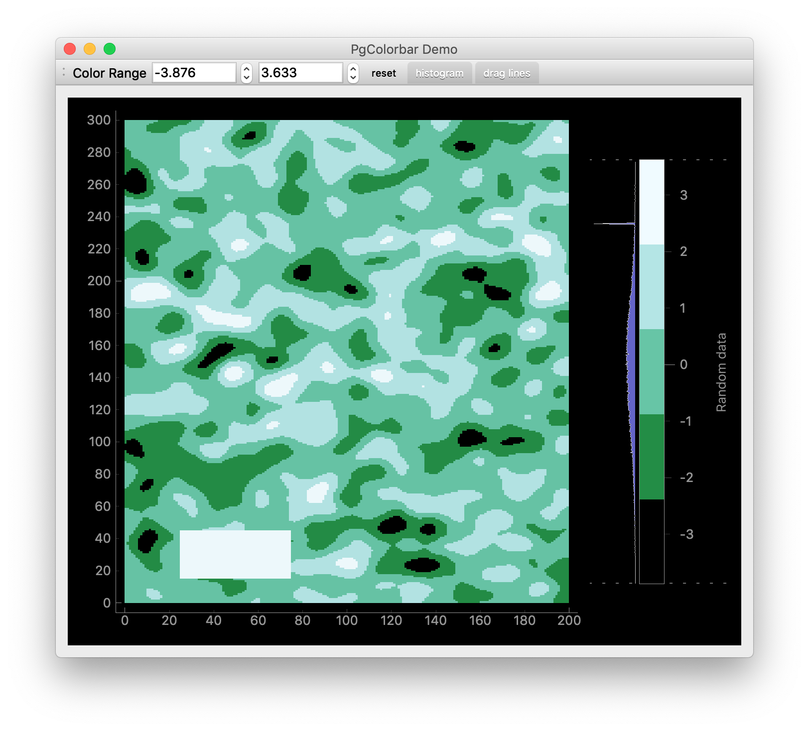

PgColorbar
==========

PgColorbar is a color bar (legend) for [PyQtGraph](http://www.pyqtgraph.org/) image plots. It can serve as a replacement for PyQtGraph's [HistogramLUTItem](http://www.pyqtgraph.org/documentation/graphicsItems/histogramlutitem.html).

I started this project because I wasn't satisfied with PyQtGraph's `HistogramLUTItem` class. This had the following two reasons:

1. There is to direct way to directly match a color in the bar with the corresponding value. In PgColorBar the tick marks are displayed directly next to the corresponding color.
2. It is not possible to define your own color scale, only the color scales defined in [GradientEditorItem.py](http://www.pyqtgraph.org/documentation/graphicsItems/gradienteditoritem.html) can be used. 

Look at the [demo.py](https://github.com/titusjan/pgcolorbar/blob/master/demo.py) program to see how to integrate PgColorbar in your own program. For a real life example see [Argos](https://github.com/titusjan/argos). 

### Installing PgColorbar

PgColorbar requires PyQtGraph. Click [here](https://github.com/pyqtgraph/pyqtgraph#installation-methods) to see how to install PyQtGraph.

After installing PyQtGraph you can install PgColorbar with Pip as follows:

    %> pip install pgcolorbar

After that you should be able to start the demo with:

    %> pgcolorbar_demo

### Using PgColorbar

The range of the color scale can be manipulated by panning and zooming the color bar as follows:

* **Pan the range:** Drag the legend using the left mouse button up or down to move the color range. This changes the intensity of the colorized image.
* **Zoom the range:** Drag the legend using the right mouse button, or scroll with the mousewheel when the cursor is above the legend. This makes the extent of the legend larger or smaller and so changes the contrast of the colorized image.
* **Change the range at one side only:** Hover the cursor over one of the dashed vertical lines (located at the edges of the color bar) until it becomes wider and the cursor changes. Then drag the line up or down. The range will change only at that end-point while the other end-point remains the same. Note that the _drag lines_ might be hidden but they still will appear if the cursor hovers above them.
* **Reset the range:** Click the middle mouse button (or mouse wheel) while the cursor is above the legend to reset the range of the legend. This uses the image to automatically determine the range.

In the demo program you can also modify the range by setting it in the spin boxes. In additiona, the demo allows you to show/hide the histogram and the _drag lines_.

